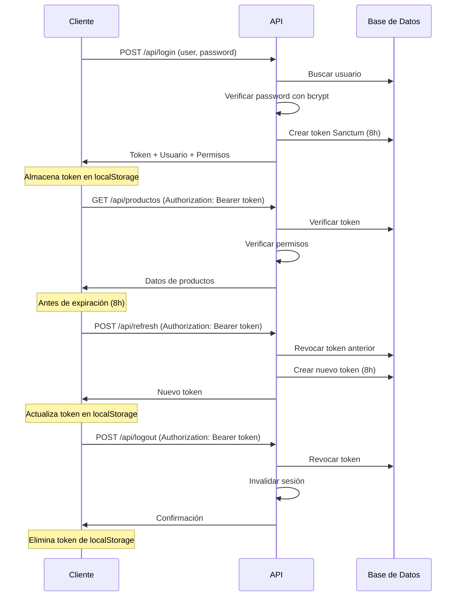

## Descripción General

El sistema utiliza **Laravel Sanctum** para la autenticación basada en tokens. Los tokens se generan durante el login y deben incluirse en todas las peticiones subsecuentes a endpoints protegidos.

## Login

Autentica a un usuario y genera un token de acceso.

<CodeGroup>
```bash Solicitud
curl -X POST https://api.example.com/api/login \
  -H "Content-Type: application/json" \
  -d '{
    "user": "admin@example.com",
    "password": "password123"
  }'
```

```json Respuesta Exitosa
{
  "success": true,
  "message": "Login exitoso",
  "token": "1|abcdefghijklmnopqrstuvwxyz1234567890",
  "user": {
    "id": 1,
    "name": "Admin",
    "email": "admin@example.com",
    "rol_id": 1,
    "id_empresa": 5
  },
  "empresas": [
    {
      "id_empresa": 5,
      "comercial": "Mi Empresa SAC",
      "ruc": "20612706702",
      "razon_social": "MI EMPRESA SOCIEDAD ANONIMA CERRADA",
      "logo": "logos/empresa_5.png",
      "direccion": "Av. Principal 123"
    }
  ],
  "permissions": [
    "productos.view",
    "productos.create",
    "productos.edit",
    "productos.delete",
    "ventas.view",
    "ventas.create"
  ]
}
```

```json Respuesta Error - Usuario no encontrado
{
  "success": false,
  "message": "Usuario no encontrado"
}
```

```json Respuesta Error - Contraseña incorrecta
{
  "success": false,
  "message": "Contraseña incorrecta"
}
```
</CodeGroup>

### Endpoint

<ParamField path="POST" type="string">
  /api/login
</ParamField>

### Parámetros del Body

<ParamField body="user" type="string" required>
  Nombre de usuario o email del usuario. Puede usar tanto el campo `name` como `email` de la base de datos.
</ParamField>

<ParamField body="password" type="string" required>
  Contraseña del usuario. Se verifica usando bcrypt hash.
</ParamField>

### Campos de Respuesta

<ResponseField name="success" type="boolean">
  Indica si la operación fue exitosa.
</ResponseField>

<ResponseField name="message" type="string">
  Mensaje descriptivo del resultado.
</ResponseField>

<ResponseField name="token" type="string">
  Token de acceso Bearer generado por Sanctum. Válido por 8 horas desde su generación.
</ResponseField>

<ResponseField name="user" type="object">
  Información del usuario autenticado.
  
  <ResponseField name="user.id" type="integer">
    ID único del usuario.
  </ResponseField>
  
  <ResponseField name="user.name" type="string">
    Nombre del usuario.
  </ResponseField>
  
  <ResponseField name="user.email" type="string">
    Email del usuario.
  </ResponseField>
  
  <ResponseField name="user.rol_id" type="integer">
    ID del rol del usuario. El rol 1 corresponde a Administrador con acceso total.
  </ResponseField>
  
  <ResponseField name="user.id_empresa" type="integer">
    ID de la empresa activa del usuario.
  </ResponseField>
</ResponseField>

<ResponseField name="empresas" type="array">
  Lista de empresas a las que el usuario tiene acceso. Los administradores (rol_id=1) ven todas las empresas activas, mientras que usuarios normales solo ven su empresa asignada.
</ResponseField>

<ResponseField name="permissions" type="array">
  Lista de permisos del usuario en formato `resource.action` (ej: `productos.view`, `ventas.create`). Los administradores reciben automáticamente todos los permisos disponibles.
</ResponseField>

### Notas de Implementación

<Info>
**Duración del Token**: Los tokens generados son válidos por **8 horas**. Después de este tiempo, el usuario debe volver a autenticarse o usar el endpoint de refresh.
</Info>

<Warning>
**Almacenamiento del Token**: Guarde el token en `localStorage` del navegador para uso posterior:

```javascript
localStorage.setItem('auth_token', response.token);
```
</Warning>

## Obtener Usuario Autenticado

Recupera la información del usuario actualmente autenticado.

<CodeGroup>
```bash Solicitud
curl -X GET https://api.example.com/api/me \
  -H "Authorization: Bearer 1|abcdefghijklmnopqrstuvwxyz1234567890"
```

```json Respuesta
{
  "success": true,
  "user": {
    "id": 1,
    "name": "Admin",
    "email": "admin@example.com",
    "rol_id": 1,
    "id_empresa": 5
  },
  "empresas": [
    {
      "id_empresa": 5,
      "comercial": "Mi Empresa SAC",
      "ruc": "20612706702",
      "razon_social": "MI EMPRESA SOCIEDAD ANONIMA CERRADA",
      "logo": "logos/empresa_5.png",
      "direccion": "Av. Principal 123"
    }
  ]
}
```
</CodeGroup>

### Endpoint

<ParamField path="GET" type="string">
  /api/me
</ParamField>

### Headers Requeridos

<ParamField header="Authorization" type="string" required>
  Bearer token obtenido del endpoint de login.
</ParamField>

## Refrescar Token

Renueva el token de autenticación actual antes de que expire.

<CodeGroup>
```bash Solicitud
curl -X POST https://api.example.com/api/refresh \
  -H "Authorization: Bearer 1|abcdefghijklmnopqrstuvwxyz1234567890"
```

```json Respuesta
{
  "success": true,
  "token": "2|zyxwvutsrqponmlkjihgfedcba0987654321"
}
```
</CodeGroup>

### Endpoint

<ParamField path="POST" type="string">
  /api/refresh
</ParamField>

### Comportamiento

1. Revoca el token actual utilizado en la petición
2. Genera un nuevo token válido por 8 horas adicionales
3. Retorna el nuevo token que debe reemplazar al anterior

<Warning>
**Token Anterior Invalidado**: Después de refrescar, el token anterior queda revocado y no puede ser utilizado. Asegúrese de actualizar el token almacenado:

```javascript
localStorage.setItem('auth_token', response.token);
```
</Warning>

## Verificar Token

Verifica si el token actual es válido y retorna información del usuario.

<CodeGroup>
```bash Solicitud
curl -X GET https://api.example.com/api/verify \
  -H "Authorization: Bearer 1|abcdefghijklmnopqrstuvwxyz1234567890"
```

```json Respuesta
{
  "success": true,
  "message": "Token válido",
  "user": {
    "id": 1,
    "name": "Admin",
    "email": "admin@example.com",
    "rol_id": 1,
    "id_empresa": 5
  }
}
```
</CodeGroup>

### Endpoint

<ParamField path="GET" type="string">
  /api/verify
</ParamField>

## Logout

Cierra la sesión del usuario y revoca el token actual.

<CodeGroup>
```bash Solicitud
curl -X POST https://api.example.com/api/logout \
  -H "Authorization: Bearer 1|abcdefghijklmnopqrstuvwxyz1234567890"
```

```json Respuesta
{
  "success": true,
  "message": "Sesión cerrada correctamente"
}
```
</CodeGroup>

### Endpoint

<ParamField path="POST" type="string">
  /api/logout
</ParamField>

### Comportamiento

1. Elimina el token de acceso de Sanctum de la base de datos
2. Invalida la sesión PHP de Laravel
3. Regenera el token CSRF

<Info>
**Limpieza del Cliente**: Después del logout exitoso, elimine el token almacenado:

```javascript
localStorage.removeItem('auth_token');
```
</Info>

## Cambiar Empresa Activa

Permite a los administradores cambiar entre diferentes empresas.

<CodeGroup>
```bash Solicitud
curl -X POST https://api.example.com/api/switch-empresa \
  -H "Authorization: Bearer 1|abcdefghijklmnopqrstuvwxyz1234567890" \
  -H "Content-Type: application/json" \
  -d '{
    "id_empresa": 8
  }'
```

```json Respuesta Exitosa
{
  "success": true,
  "message": "Empresa cambiada exitosamente",
  "id_empresa": 8
}
```

```json Respuesta Error - Sin permisos
{
  "success": false,
  "message": "No tiene permisos para cambiar de empresa"
}
```
</CodeGroup>

### Endpoint

<ParamField path="POST" type="string">
  /api/switch-empresa
</ParamField>

### Parámetros del Body

<ParamField body="id_empresa" type="integer" required>
  ID de la empresa a la que se desea cambiar. Debe ser una empresa activa en el sistema.
</ParamField>

<Warning>
**Solo Administradores**: Esta funcionalidad está disponible únicamente para usuarios con `rol_id = 1` (Administradores). Usuarios normales reciben un error 403.
</Warning>

## Flujo de Autenticación Completo



## Configuración de Sanctum

El sistema está configurado con los siguientes parámetros:

- **Expiración**: Los tokens no expiran automáticamente en la BD, pero se generan con una validez de 8 horas mediante el método `createToken()`
- **Dominios con estado**: localhost, localhost:3000, 127.0.0.1, 127.0.0.1:8000, ::1
- **Guard**: `web`
- **Prefix de token**: Sin prefijo configurado

<Info>
La configuración completa se encuentra en `config/sanctum.php`
</Info>