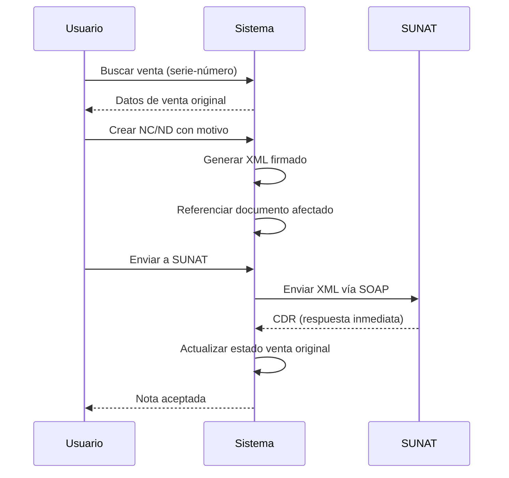

## Descripción General

Las **Notas de Crédito** (código 07) y **Notas de Débito** (código 08) son documentos que modifican facturas o boletas previamente emitidas.

### Casos de Uso

**Nota de Crédito (NC)**:
- Anulación de venta
- Devolución de productos
- Descuento o bonificación
- Corrección de errores en el monto

**Nota de Débito (ND)**:
- Incremento en el valor de venta
- Intereses por mora
- Gastos adicionales no incluidos

## Flujo de Emisión

Ambos tipos de notas siguen el mismo flujo **síncrono** que las facturas:



## Formato de Series

| Documento Afectado | Serie NC | Serie ND |
|--------------------|----------|----------|
| Factura (01) | FC01 | FD01 |
| Boleta (03) | BC01 | BD01 |

La serie se determina automáticamente según el tipo de documento referenciado.

## Notas de Crédito

### Generación de XML

Método `generarNotaCreditoXml()` en `SunatService.php` (líneas 314-374):

```php
public function generarNotaCreditoXml(NotaCredito $nota): array
{
    $nota->load(['venta.cliente', 'venta.empresa', 'venta.productosVentas', 'motivo']);
    $empresa = $nota->venta->empresa;
    $cliente = $nota->venta->cliente;
    $igvRate = (float) ($empresa->igv ?? config('sunat.igv'));

    $company = $this->buildCompany($empresa);
    $client = $this->buildClient($cliente);

    $total = (float) $nota->monto_total;
    $montoGravada = round($total / ($igvRate + 1), 2);
    $igvMonto = round($total / ($igvRate + 1) * $igvRate, 2);

    $note = new Note();
    $note->setUblVersion('2.1')
        ->setTipoDoc('07') // Nota de Crédito
        ->setSerie($nota->serie)
        ->setCorrelativo((string) $nota->numero)
        ->setFechaEmision($this->fechaParaGreenter($nota->fecha_emision, $nota->created_at))
        
        // Referencia al documento afectado
        ->setTipDocAfectado($nota->tipo_doc_afectado) // '01' o '03'
        ->setNumDocfectado($nota->serie_num_afectado)  // 'F001-123'
        
        // Motivo
        ->setCodMotivo($nota->motivo->codigo_sunat)     // '01', '02', etc.
        ->setDesMotivo($nota->descripcion_motivo ?? $nota->motivo->descripcion)
        
        ->setTipoMoneda($nota->moneda ?? 'PEN')
        ->setCompany($company)
        ->setClient($client)
        ->setMtoOperGravadas($montoGravada)
        ->setMtoIGV($igvMonto)
        ->setTotalImpuestos($igvMonto)
        ->setMtoImpVenta(round($total, 2));

    // Detalles: se copian de la venta original
    $details = $this->buildSaleDetailsFromVenta($nota->venta, $igvRate);
    $note->setDetails($details);

    // Leyenda
    $note->setLegends([
        (new Legend())
            ->setCode('1000')
            ->setValue('SON ' . strtoupper($this->numberToWords($total)) . ' SOLES')
    ]);

    $see = $this->getSee($empresa);
    $xmlContent = $see->getXmlSigned($note);
    $nombreArchivo = $note->getName();

    $this->guardarXml($empresa, $nombreArchivo, $xmlContent);
    $hash = $this->getHashFromXml($xmlContent);

    $nota->update([
        'hash_cpe' => $hash,
        'xml_url' => "sunat/xml/{$this->getRuc($empresa)}/{$nombreArchivo}.xml",
        'nombre_xml' => $nombreArchivo,
    ]);

    return [
        'success' => true,
        'nombre_archivo' => $nombreArchivo,
        'hash' => $hash,
    ];
}
```

### Envío a SUNAT

Método `enviarNotaCredito()` (líneas 376-439):

```php
public function enviarNotaCredito(NotaCredito $nota): array
{
    $nota->load(['venta.empresa']);
    $empresa = $nota->venta->empresa;
    $ruc = $this->getRuc($empresa);

    $xmlPath = storage_path("app/sunat/xml/{$ruc}/{$nota->nombre_xml}.xml");

    if (!file_exists($xmlPath)) {
        return ['success' => false, 'message' => 'XML no encontrado. Genere el XML primero.'];
    }

    $xmlContent = file_get_contents($xmlPath);
    $see = $this->getSee($empresa);
    $result = $see->sendXml(Note::class, $nota->nombre_xml, $xmlContent);

    if ($result->isSuccess()) {
        $cdr = $result->getCdrResponse();
        $cdrZip = $result->getCdrZip();

        // Guardar CDR
        $cdrDir = storage_path("app/sunat/cdr/{$ruc}");
        if (!is_dir($cdrDir)) {
            mkdir($cdrDir, 0755, true);
        }
        file_put_contents("{$cdrDir}/R-{$nota->nombre_xml}.zip", $cdrZip);

        $nota->update([
            'estado' => 'aceptado',
            'cdr_url' => "sunat/cdr/{$ruc}/R-{$nota->nombre_xml}.zip",
            'codigo_sunat' => $cdr->getCode(),
            'mensaje_sunat' => $cdr->getDescription(),
        ]);

        // IMPORTANTE: Marcar la venta original como anulada
        $nota->venta->update([
            'estado' => '2',        // Anulado
            'estado_sunat' => '2',  // Rechazado/Anulado
        ]);

        return [
            'success' => true,
            'codigo' => $cdr->getCode(),
            'mensaje' => $cdr->getDescription(),
        ];
    }

    // Error
    $error = $result->getError();
    $nota->update([
        'estado' => 'rechazado',
        'codigo_sunat' => $error->getCode(),
        'mensaje_sunat' => $error->getMessage(),
    ]);

    return [
        'success' => false,
        'codigo' => $error->getCode(),
        'message' => $error->getMessage(),
    ];
}
```

### Creación desde Controller

`NotaCreditoController.php` líneas 31-106:

```php
public function store(Request $request): JsonResponse
{
    $request->validate([
        'id_venta' => 'required|exists:ventas,id_venta',
        'motivo_id' => 'required|exists:motivo_nota,id',
        'descripcion_motivo' => 'nullable|string|max:255',
    ]);

    return DB::transaction(function () use ($request) {
        $venta = Venta::with(['empresa', 'cliente', 'tipoDocumento', 'productosVentas'])
            ->findOrFail($request->id_venta);

        $empresa = $venta->empresa;
        $motivo = MotivoNota::findOrFail($request->motivo_id);

        // Determinar serie según documento afectado
        $tipDocAfectado = $venta->tipoDocumento->cod_sunat;
        $serieNC = $tipDocAfectado === '01' ? 'FC01' : 'BC01';

        $ultimoNumero = NotaCredito::where('serie', $serieNC)
            ->where('id_empresa', $empresa->id_empresa)
            ->max('numero') ?? 0;

        // Consultar documentos_empresas como número base
        $numeroBase = DB::table('documentos_empresas')
            ->where('id_empresa', $empresa->id_empresa)
            ->where('serie', $serieNC)
            ->value('numero') ?? 0;

        $ultimoNumero = max($ultimoNumero, $numeroBase);

        // Sincronizar documentos_empresas
        DB::table('documentos_empresas')
            ->where('id_empresa', $empresa->id_empresa)
            ->where('serie', $serieNC)
            ->update(['numero' => $ultimoNumero + 1]);

        $nota = NotaCredito::create([
            'id_venta' => $venta->id_venta,
            'motivo_id' => $motivo->id,
            'serie' => $serieNC,
            'numero' => $ultimoNumero + 1,
            'tipo_doc_afectado' => $tipDocAfectado,
            'serie_num_afectado' => $venta->serie . '-' . $venta->numero,
            'descripcion_motivo' => $request->descripcion_motivo ?? $motivo->descripcion,
            'monto_subtotal' => $venta->subtotal,
            'monto_igv' => $venta->igv,
            'monto_total' => $venta->total,
            'moneda' => $venta->tipo_moneda ?? 'PEN',
            'fecha_emision' => now()->toDateString(),
            'estado' => 'pendiente',
            'id_empresa' => $empresa->id_empresa,
            'id_usuario' => $request->user()->id,
        ]);

        $resultado = $this->sunatService->generarNotaCreditoXml($nota);

        return response()->json([
            'success' => true,
            'data' => $nota,
            'xml' => $resultado,
        ], 201);
    });
}
```

## Notas de Débito

### Generación de XML

Método `generarNotaDebitoXml()` (líneas 441-501) - Similar a NC pero con `tipoDoc = '08'`:

```php
public function generarNotaDebitoXml(NotaDebito $nota): array
{
    $nota->load(['venta.cliente', 'venta.empresa', 'venta.productosVentas', 'motivo']);
    $empresa = $nota->venta->empresa;
    $cliente = $nota->venta->cliente;
    $igvRate = (float) ($empresa->igv ?? config('sunat.igv'));

    $company = $this->buildCompany($empresa);
    $client = $this->buildClient($cliente);

    $total = (float) $nota->monto_total;
    $montoGravada = round($total / ($igvRate + 1), 2);
    $igvMonto = round($total / ($igvRate + 1) * $igvRate, 2);

    $note = new Note();
    $note->setUblVersion('2.1')
        ->setTipoDoc('08') // Nota de Débito
        ->setSerie($nota->serie)
        ->setCorrelativo((string) $nota->numero)
        ->setFechaEmision($this->fechaParaGreenter($nota->fecha_emision, $nota->created_at))
        ->setTipDocAfectado($nota->tipo_doc_afectado)
        ->setNumDocfectado($nota->serie_num_afectado)
        ->setCodMotivo($nota->motivo->codigo_sunat)
        ->setDesMotivo($nota->descripcion_motivo ?? $nota->motivo->descripcion)
        ->setTipoMoneda($nota->moneda ?? 'PEN')
        ->setCompany($company)
        ->setClient($client)
        ->setMtoOperGravadas($montoGravada)
        ->setMtoIGV($igvMonto)
        ->setTotalImpuestos($igvMonto)
        ->setMtoImpVenta(round($total, 2));

    $details = $this->buildSaleDetailsFromVenta($nota->venta, $igvRate);
    $note->setDetails($details);

    $note->setLegends([
        (new Legend())
            ->setCode('1000')
            ->setValue('SON ' . strtoupper($this->numberToWords($total)) . ' SOLES')
    ]);

    $see = $this->getSee($empresa);
    $xmlContent = $see->getXmlSigned($note);
    $nombreArchivo = $note->getName();

    $this->guardarXml($empresa, $nombreArchivo, $xmlContent);
    $hash = $this->getHashFromXml($xmlContent);

    $nota->update([
        'hash_cpe' => $hash,
        'xml_url' => "sunat/xml/{$this->getRuc($empresa)}/{$nombreArchivo}.xml",
        'nombre_xml' => $nombreArchivo,
    ]);

    return [
        'success' => true,
        'nombre_archivo' => $nombreArchivo,
        'hash' => $hash,
    ];
}
```

### Envío a SUNAT

Método `enviarNotaDebito()` (líneas 503-560) - Idéntico a NC pero sin anular la venta:

```php
public function enviarNotaDebito(NotaDebito $nota): array
{
    $nota->load(['venta.empresa']);
    $empresa = $nota->venta->empresa;
    $ruc = $this->getRuc($empresa);

    $xmlPath = storage_path("app/sunat/xml/{$ruc}/{$nota->nombre_xml}.xml");

    if (!file_exists($xmlPath)) {
        return ['success' => false, 'message' => 'XML no encontrado. Genere el XML primero.'];
    }

    $xmlContent = file_get_contents($xmlPath);
    $see = $this->getSee($empresa);
    $result = $see->sendXml(Note::class, $nota->nombre_xml, $xmlContent);

    if ($result->isSuccess()) {
        $cdr = $result->getCdrResponse();
        $cdrZip = $result->getCdrZip();

        $cdrDir = storage_path("app/sunat/cdr/{$ruc}");
        if (!is_dir($cdrDir)) {
            mkdir($cdrDir, 0755, true);
        }
        file_put_contents("{$cdrDir}/R-{$nota->nombre_xml}.zip", $cdrZip);

        $nota->update([
            'estado' => 'aceptado',
            'cdr_url' => "sunat/cdr/{$ruc}/R-{$nota->nombre_xml}.zip",
            'codigo_sunat' => $cdr->getCode(),
            'mensaje_sunat' => $cdr->getDescription(),
        ]);

        // NOTA: La ND NO anula la venta original, solo la incrementa

        return [
            'success' => true,
            'codigo' => $cdr->getCode(),
            'mensaje' => $cdr->getDescription(),
        ];
    }

    $error = $result->getError();
    $nota->update([
        'estado' => 'rechazado',
        'codigo_sunat' => $error->getCode(),
        'mensaje_sunat' => $error->getMessage(),
    ]);

    return [
        'success' => false,
        'codigo' => $error->getCode(),
        'message' => $error->getMessage(),
    ];
}
```

## Motivos Catálogo SUNAT

### Notas de Crédito

| Código | Descripción |
|--------|-------------|
| 01 | Anulación de la operación |
| 02 | Anulación por error en el RUC |
| 03 | Corrección por error en la descripción |
| 04 | Descuento global |
| 05 | Descuento por ítem |
| 06 | Devolución total |
| 07 | Devolución por ítem |
| 08 | Bonificación |
| 09 | Disminución en el valor |
| 10 | Otros conceptos |

### Notas de Débito

| Código | Descripción |
|--------|-------------|
| 01 | Intereses por mora |
| 02 | Aumento en el valor |
| 03 | Penalidades |
| 04 | Otros conceptos |

### Obtener Motivos desde API

```http
GET /api/notas-credito/motivos
GET /api/notas-debito/motivos
```

Ver `NotaCreditoController.php` líneas 224-231:

```php
public function motivos(): JsonResponse
{
    $motivos = MotivoNota::where('tipo', 'NC')
        ->where('estado', true)
        ->get();

    return response()->json(['success' => true, 'data' => $motivos]);
}
```

## Búsqueda de Venta Original

Endpoint para buscar la venta a referenciar (`NotaCreditoController.php` líneas 196-222):

```php
public function buscarVenta(Request $request): JsonResponse
{
    $request->validate([
        'serie' => 'required|string|max:4',
        'numero' => 'required|string',
    ]);

    $user = $request->user();

    $venta = Venta::with(['cliente', 'tipoDocumento', 'productosVentas.producto'])
        ->where('id_empresa', $user->id_empresa)
        ->where('serie', strtoupper($request->serie))
        ->where('numero', (int) $request->numero)
        ->first();

    if (!$venta) {
        return response()->json([
            'success' => false,
            'message' => 'Venta no encontrada con esa serie y número.',
        ], 404);
    }

    return response()->json([
        'success' => true,
        'venta' => $venta,
    ]);
}
```

### Uso desde Frontend

```http
GET /api/notas-credito/buscar-venta?serie=F001&numero=123
```

Respuesta:

```json
{
  "success": true,
  "venta": {
    "id_venta": 100,
    "serie": "F001",
    "numero": 123,
    "total": 118.00,
    "cliente": {
      "documento": "20612706702",
      "datos": "EMPRESA SAC"
    },
    "tipoDocumento": {
      "cod_sunat": "01",
      "abreviatura": "FACTURA"
    },
    "productosVentas": [...]
  }
}
```

## Diferencias Clave: NC vs ND

| Aspecto | Nota de Crédito | Nota de Débito |
|---------|-----------------|----------------|
| Código SUNAT | 07 | 08 |
| Propósito | Reducir/anular venta | Aumentar venta |
| Efecto en venta | Anula la venta original | Mantiene venta activa |
| Monto | Igual o menor a venta | Monto adicional |
| Estado venta | `estado=2` (anulado) | Sin cambio |
| Caso común | Devolución, error | Intereses, penalidad |

## Construcción de Detalles desde Venta Original

Método `buildSaleDetailsFromVenta()` (líneas 903-933):

```php
private function buildSaleDetailsFromVenta(Venta $venta, float $igvRate): array
{
    $details = [];

    foreach ($venta->productosVentas as $item) {
        $precio = (float) $item->precio_unitario;
        $cantidad = (float) $item->cantidad;
        $valorUnitario = round($precio / ($igvRate + 1), 2);
        $valorVenta = round($precio * $cantidad / ($igvRate + 1), 2);
        $igvItem = round($precio * $cantidad / ($igvRate + 1) * $igvRate, 2);

        $detail = new SaleDetail();
        $detail->setCodProducto($item->codigo_producto ?? 'P001')
            ->setCodProdSunat('10000000')
            ->setUnidad($item->unidad_medida ?? 'NIU')
            ->setDescripcion($item->descripcion ?? 'Producto')
            ->setCantidad($cantidad)
            ->setMtoValorUnitario($valorUnitario)
            ->setMtoValorVenta($valorVenta)
            ->setMtoBaseIgv($valorVenta)
            ->setPorcentajeIgv($igvRate * 100)
            ->setIgv($igvItem)
            ->setTipAfeIgv($item->tipo_afectacion_igv ?? '10')
            ->setTotalImpuestos($igvItem)
            ->setMtoPrecioUnitario(round($precio, 2));

        $details[] = $detail;
    }

    return $details;
}
```

## Endpoints API

### Notas de Crédito

```http
# Listar
GET /api/notas-credito

# Crear
POST /api/notas-credito
{
  "id_venta": 100,
  "motivo_id": 1,
  "descripcion_motivo": "Anulación por solicitud del cliente"
}

# Ver detalle
GET /api/notas-credito/{id}

# Enviar a SUNAT
POST /api/notas-credito/{id}/enviar

# Descargar CDR
GET /api/notas-credito/{id}/cdr

# Ver XML
GET /api/notas-credito/xml/{nombre}
```

### Notas de Débito

```http
# Listar
GET /api/notas-debito

# Crear
POST /api/notas-debito
{
  "id_venta": 100,
  "motivo_id": 1,
  "monto_total": 50.00,
  "descripcion_motivo": "Intereses por pago tardío"
}

# Enviar a SUNAT
POST /api/notas-debito/{id}/enviar
```

## Estados de Nota

| Estado | Descripción |
|--------|-------------|
| `pendiente` | XML generado, no enviado |
| `aceptado` | SUNAT aceptó la nota |
| `rechazado` | SUNAT rechazó la nota |

## Nomenclatura de Archivos

```
# XML de Nota de Crédito
20612706702-07-FC01-00000001.xml

# CDR de Nota de Crédito
R-20612706702-07-FC01-00000001.zip

# XML de Nota de Débito
20612706702-08-FD01-00000001.xml
```

Formato: `{RUC}-{tipoDoc}-{serie}-{correlativo}.xml`

## Recursos

- [Facturas y Boletas](/sunat/facturas-boletas)
- [Comunicación de Baja](/sunat/voiding)
- [Resumen Diario](/sunat/daily-summary)
