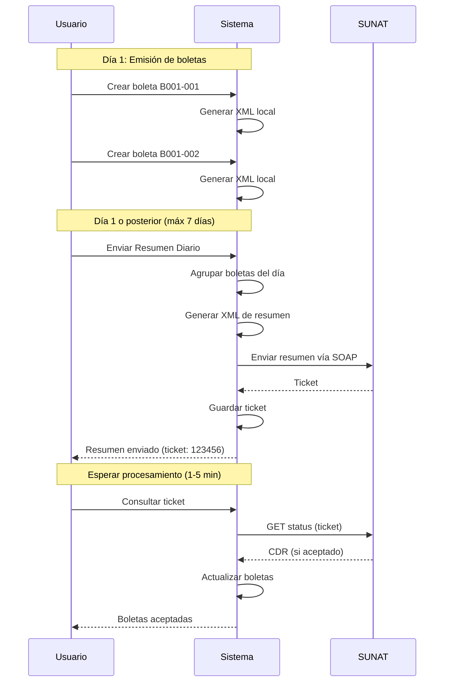

## Descripción General

El **Resumen Diario** es un documento que agrupa boletas (03) y notas de venta emitidas en un día. Es **obligatorio** para que SUNAT acepte las boletas.

## Obligatoriedad

A diferencia de las facturas (que se envían individualmente), las **boletas deben enviarse por Resumen Diario**. Esto permite agrupar múltiples boletas en un solo envío.

## Flujo de Resumen Diario



## Plazo de Envío

SUNAT permite enviar boletas dentro de los **7 días** siguientes a la emisión. Después de este plazo, el documento no puede ser enviado.

## Generación de Resumen Diario

Método `resumenDiario()` en `SunatService.php` (líneas 1022-1115):

```php
public function resumenDiario(
    Empresa $empresa, 
    array $ventas, 
    string $fechaResumen, 
    string $correlativo = '001', 
    string $estado = '1'
): array {
    $company = $this->buildCompany($empresa);
    $igvRate = (float) ($empresa->igv ?? config('sunat.igv'));

    $details = [];
    foreach ($ventas as $venta) {
        $total = (float) $venta->total;
        $apliIgv = (float) $venta->igv > 0;

        $montoGravada = $apliIgv ? round($total / ($igvRate + 1), 2) : 0;
        $igvMonto = $apliIgv ? round($total / ($igvRate + 1) * $igvRate, 2) : 0;
        $montoExonerada = $apliIgv ? 0 : $total;

        $cliente = $venta->cliente;
        $tipoDocCliente = '0';
        $numDocCliente = '00000000';
        $documento = $cliente->documento ?? '';

        if (strlen($documento) === 11) {
            $tipoDocCliente = '6';  // RUC
            $numDocCliente = $documento;
        } elseif (strlen($documento) === 8) {
            $tipoDocCliente = '1';  // DNI
            $numDocCliente = $documento;
        }

        $codSunat = $venta->tipoDocumento->cod_sunat ?? '03';

        $detail = (new SummaryDetail())
            ->setTipoDoc($codSunat)
            ->setSerieNro($venta->serie . '-' . $venta->numero)
            ->setEstado($estado)  // '1' = Adición, '3' = Anulación
            ->setClienteTipo($tipoDocCliente)
            ->setClienteNro($numDocCliente)
            ->setTotal($total)
            ->setMtoOperGravadas($montoGravada)
            ->setMtoOperExoneradas($montoExonerada)
            ->setMtoOperInafectas(0)
            ->setMtoOtrosCargos(0)
            ->setMtoIGV($igvMonto);

        $details[] = $detail;
    }

    if (empty($details)) {
        return ['success' => false, 'message' => 'No hay documentos para el resumen.'];
    }

    $summary = (new Summary())
        ->setFecGeneracion(new \DateTime())
        ->setFecResumen(\DateTime::createFromFormat('Y-m-d', $fechaResumen))
        ->setCorrelativo($correlativo)
        ->setCompany($company)
        ->setDetails($details);

    $see = $this->getSee($empresa);
    $nombreArchivo = $summary->getName();

    $result = $see->send($summary);

    $xmlContent = $see->getFactory()->getLastXml();
    if ($xmlContent) {
        $this->guardarXml($empresa, $nombreArchivo, $xmlContent);
    }

    if ($result->isSuccess()) {
        $ticket = $result->getTicket();

        return [
            'success' => true,
            'ticket' => $ticket,
            'nombre_archivo' => $nombreArchivo,
            'cantidad' => count($details),
            'message' => 'Resumen diario enviado. Use el ticket para consultar el estado.',
        ];
    }

    $error = $result->getError();
    return [
        'success' => false,
        'codigo' => $error->getCode(),
        'message' => $error->getMessage(),
    ];
}
```

## Estados de Resumen

El parámetro `$estado` en `SummaryDetail` indica el tipo de operación:

| Código | Estado | Uso |
|--------|--------|-----|
| `1` | Adición | Registrar nuevas boletas |
| `2` | Modificación | Actualizar boletas existentes |
| `3` | Anulación | Anular boletas |

## Consulta de Ticket

Método `consultarTicket()` (líneas 1128-1175):

```php
public function consultarTicket(Empresa $empresa, string $ticket): array
{
    $see = $this->getSee($empresa);
    $result = $see->getStatus($ticket);
    $ruc = $this->getRuc($empresa);

    if ($result->isSuccess()) {
        $cdr = $result->getCdrResponse();
        $cdrZip = $result->getCdrZip();

        if ($cdrZip) {
            $cdrDir = storage_path("app/sunat/cdr/{$ruc}");
            if (!is_dir($cdrDir)) {
                mkdir($cdrDir, 0755, true);
            }
            file_put_contents("{$cdrDir}/R-ticket-{$ticket}.zip", $cdrZip);
        }

        return [
            'success' => true,
            'codigo' => $cdr->getCode(),
            'mensaje' => $cdr->getDescription(),
            'notas' => $cdr->getNotes() ?? [],
        ];
    }

    $code = $result->getCode();
    if ($code === '98') {
        return [
            'success' => true,
            'codigo' => '98',
            'mensaje' => 'En proceso. Intente nuevamente en unos segundos.',
            'en_proceso' => true,
        ];
    }

    $error = $result->getError();
    return [
        'success' => false,
        'codigo' => $error ? $error->getCode() : $code,
        'message' => $error ? $error->getMessage() : 'Error desconocido',
    ];
}
```

## Códigos de Respuesta

| Código | Estado | Descripción |
|--------|--------|-------------|
| `0` | Aceptado | Resumen procesado correctamente |
| `98` | En proceso | Aún procesando, reintentar |
| `99` | Procesado con errores | Ver detalles en notas |
| Otros | Error | Ver mensaje de error |

## Controller de Resumen Diario

`ResumenDiarioController.php` implementa el envío desde la API.

### Enviar Resumen Diario

Método `store()` (líneas 15-92):

```php
public function store(Request $request): JsonResponse
{
    $request->validate([
        'ids' => 'required|array|min:1',
        'ids.*' => 'integer|exists:ventas,id_venta',
        'fecha_resumen' => 'required|date_format:Y-m-d',
    ]);

    $empresa = Empresa::findOrFail($request->user()->id_empresa);

    $ventas = Venta::with(['tipoDocumento', 'cliente'])
        ->whereIn('id_venta', $request->ids)
        ->where('id_empresa', $empresa->id_empresa)
        ->get();

    if ($ventas->isEmpty()) {
        return response()->json([
            'success' => false,
            'message' => 'No se encontraron ventas válidas.',
        ], 422);
    }

    $errores = [];
    $boletasValidas = [];

    foreach ($ventas as $venta) {
        $codSunat = $venta->tipoDocumento->cod_sunat ?? '';

        // Validación: Solo boletas (03)
        if ($codSunat !== '03') {
            $errores[] = "{$venta->numero_completo}: Solo boletas (03) se envían por Resumen Diario.";
            continue;
        }

        // Validación: Plazo máximo 7 días
        $fechaEmision = $venta->fecha_emision;
        if ($fechaEmision && $fechaEmision->diffInDays(now()) > 7) {
            $errores[] = "{$venta->numero_completo}: El plazo máximo para envío por Resumen Diario es 7 días desde la emisión.";
            continue;
        }

        $boletasValidas[] = $venta;
    }

    if (empty($boletasValidas)) {
        return response()->json([
            'success' => false,
            'message' => 'Ninguna boleta pasó la validación.',
            'errores' => $errores,
        ], 422);
    }

    try {
        $resultado = $this->sunatService->resumenDiario(
            $empresa,
            $boletasValidas,
            $request->fecha_resumen,
        );

        if ($resultado['success']) {
            foreach ($boletasValidas as $venta) {
                $venta->update([
                    'estado_sunat' => '3',  // En proceso (ticket)
                    'mensaje_sunat' => 'Resumen diario enviado. Ticket: ' . ($resultado['ticket'] ?? ''),
                ]);
            }
        }

        if (!empty($errores)) {
            $resultado['advertencias'] = $errores;
        }

        return response()->json($resultado);
    } catch (\Exception $e) {
        return response()->json([
            'success' => false,
            'message' => 'Error al enviar resumen diario: ' . $e->getMessage(),
        ], 500);
    }
}
```

### Consultar Ticket desde Controller

Método `consultarTicket()` (líneas 172-189):

```php
public function consultarTicket(Request $request): JsonResponse
{
    $request->validate([
        'ticket' => 'required|string',
    ]);

    $empresa = Empresa::findOrFail($request->user()->id_empresa);

    try {
        $resultado = $this->sunatService->consultarTicket($empresa, $request->ticket);
        return response()->json($resultado);
    } catch (\Exception $e) {
        return response()->json([
            'success' => false,
            'message' => 'Error al consultar ticket: ' . $e->getMessage(),
        ], 500);
    }
}
```

## Resumen Diario de Baja

Para **anular boletas** previamente aceptadas, se usa el mismo resumen pero con `estado = '3'`:

```php
public function resumenDiarioBaja(
    Empresa $empresa, 
    array $ventas, 
    string $fechaResumen, 
    string $correlativo = '001'
): array {
    return $this->resumenDiario($empresa, $ventas, $fechaResumen, $correlativo, '3');
}
```

Ver `SunatService.php` líneas 1120-1123.

### Endpoint de Anulación

`ResumenDiarioController.php` método `anular()` (líneas 94-170):

```php
public function anular(Request $request): JsonResponse
{
    $request->validate([
        'ids' => 'required|array|min:1',
        'ids.*' => 'integer|exists:ventas,id_venta',
        'fecha_resumen' => 'required|date_format:Y-m-d',
    ]);

    $empresa = Empresa::findOrFail($request->user()->id_empresa);

    $ventas = Venta::with(['tipoDocumento', 'cliente'])
        ->whereIn('id_venta', $request->ids)
        ->where('id_empresa', $empresa->id_empresa)
        ->get();

    $errores = [];
    $boletasValidas = [];

    foreach ($ventas as $venta) {
        $codSunat = $venta->tipoDocumento->cod_sunat ?? '';

        if ($codSunat !== '03') {
            $errores[] = "{$venta->numero_completo}: Solo boletas (03) se anulan por Resumen Diario.";
            continue;
        }

        // Validación: La boleta debe estar aceptada (estado_sunat=1)
        if ($venta->estado_sunat != '1') {
            $errores[] = "{$venta->numero_completo}: La boleta debe estar aceptada por SUNAT para poder anularla.";
            continue;
        }

        $boletasValidas[] = $venta;
    }

    if (empty($boletasValidas)) {
        return response()->json([
            'success' => false,
            'message' => 'Ninguna boleta pasó la validación para anulación.',
            'errores' => $errores,
        ], 422);
    }

    try {
        $resultado = $this->sunatService->resumenDiarioBaja(
            $empresa,
            $boletasValidas,
            $request->fecha_resumen,
        );

        if ($resultado['success']) {
            foreach ($boletasValidas as $venta) {
                $venta->update([
                    'estado_sunat' => '3',  // En proceso
                    'mensaje_sunat' => 'Anulación por resumen diario enviada. Ticket: ' . ($resultado['ticket'] ?? ''),
                ]);
            }
        }

        return response()->json($resultado);
    } catch (\Exception $e) {
        return response()->json([
            'success' => false,
            'message' => 'Error al enviar anulación: ' . $e->getMessage(),
        ], 500);
    }
}
```

## Nomenclatura de Archivos

El nombre del archivo de resumen sigue el formato:

```
{RUC}-RC-{fecha}-{correlativo}.xml
```

Ejemplo:
```
20612706702-RC-20240115-001.xml
```

Donde:
- `RC` = Resumen Diario ("Resumen de Comprobantes")
- Fecha en formato `YYYYMMDD`
- Correlativo de 3 dígitos

## Endpoints API

```http
# Enviar Resumen Diario
POST /api/resumen-diario
Authorization: Bearer {token}
{
  "ids": [100, 101, 102],
  "fecha_resumen": "2024-01-15"
}

# Anular Boletas por Resumen Diario
POST /api/resumen-diario/anular
{
  "ids": [100, 101],
  "fecha_resumen": "2024-01-15"
}

# Consultar Ticket
POST /api/resumen-diario/consultar-ticket
{
  "ticket": "1234567890"
}
```

## Validaciones Implementadas

### Al Enviar Resumen Diario

1. Solo se aceptan **boletas** (código 03)
2. Plazo máximo: **7 días** desde la emisión
3. Al menos **1 boleta** debe ser válida

### Al Anular por Resumen Diario

1. Solo se aceptan **boletas** (código 03)
2. La boleta debe estar **aceptada por SUNAT** (`estado_sunat = 1`)
3. Al menos **1 boleta** debe ser válida

## Actualización de Estados

Al enviar el resumen exitosamente:

```php
$venta->update([
    'estado_sunat' => '3',  // En proceso (esperando CDR)
    'mensaje_sunat' => 'Resumen diario enviado. Ticket: 1234567890',
]);
```

Al consultar el ticket y obtener aceptación:

```php
// El estado se actualiza a '1' (aceptado) manualmente
// o mediante lógica adicional al consultar ticket
```

## Diferencias: Resumen Diario vs Comunicación de Baja

| Aspecto | Resumen Diario | Comunicación de Baja |
|---------|----------------|----------------------|
| Documentos | Boletas (03) | Facturas (01), NC (07), ND (08) |
| Propósito | Registrar/anular boletas | Anular facturas |
| Clase Greenter | `Summary` | `Voided` |
| Obligatorio | Sí (para boletas) | No (opcional para facturas) |
| Estado en detalle | `1` (adición) o `3` (anulación) | Solo anulación |

Ver [Comunicación de Baja](/sunat/voiding) para detalles sobre anulación de facturas.

## Recursos

- [Facturas y Boletas](/sunat/facturas-boletas)
- [Comunicación de Baja](/sunat/voiding)
- [Notas de Crédito y Débito](/sunat/credit-debit-notes)
