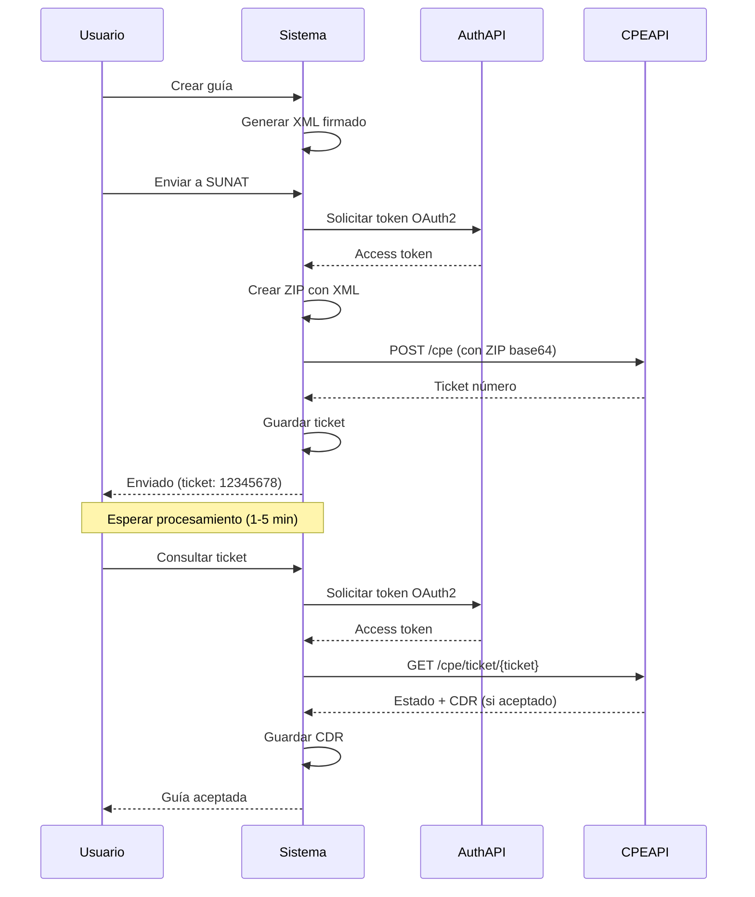

## Descripción General

Las **Guías de Remisión Electrónicas** (código 09) son documentos que sustentan el traslado de bienes. A diferencia de facturas y boletas, las GRE usan una API REST moderna con autenticación OAuth2.

## Flujo Asíncrono con Tickets

Las guías siguen un flujo **asíncrono** completamente diferente:



## Formato de Series

| Serie | Uso |
|-------|-----|
| T001 | Guías de remisión (único) |

La serie es fija en `T001` para todas las guías.

## Generación de XML

Método `generarGuiaRemisionXml()` en `SunatService.php` (líneas 562-666):

```php
public function generarGuiaRemisionXml(GuiaRemision $guia): array
{
    $guia->load(['empresa', 'detalles']);
    $empresa = $guia->empresa;

    $company = $this->buildCompany($empresa);

    // Fechas en timezone America/Lima
    $fechaEmision = $this->fechaParaGreenter($guia->fecha_emision, $guia->created_at);
    $fechaTraslado = $this->fechaParaGreenter($guia->fecha_traslado);

    // Destinatario
    $destinatario = (new Client())
        ->setTipoDoc($guia->destinatario_tipo_doc)  // '1' DNI o '6' RUC
        ->setNumDoc($guia->destinatario_documento)
        ->setRznSocial($guia->destinatario_nombre);

    // Envío (información del traslado)
    $shipment = (new Shipment())
        ->setCodTraslado($guia->motivo_traslado)      // '01' Venta, '04' Traslado, etc.
        ->setDesTraslado($guia->descripcion_motivo)
        ->setModTraslado($guia->mod_transporte)       // '01' Público, '02' Privado
        ->setFecTraslado($fechaTraslado)
        ->setPesoTotal((float) $guia->peso_total)
        ->setUndPesoTotal($guia->und_peso_total ?? 'KGM') // Kilogramos
        ->setPartida(new Direction($guia->ubigeo_partida, $guia->dir_partida))
        ->setLlegada(new Direction($guia->ubigeo_llegada, $guia->dir_llegada));

    // Transporte PÚBLICO (01): requiere transportista
    if ($guia->mod_transporte === '01' && $guia->transportista_documento) {
        $transportista = (new Transportist())
            ->setTipoDoc($guia->transportista_tipo_doc)
            ->setNumDoc($guia->transportista_documento)
            ->setRznSocial($guia->transportista_nombre)
            ->setNroMtc($guia->transportista_nro_mtc); // Número de registro MTC
        $shipment->setTransportista($transportista);
    }

    // Transporte PRIVADO (02): requiere conductor y vehículo
    if ($guia->mod_transporte === '02') {
        // Indicador M1/L (vehículos categoría M1 o L)
        $indicadores = [];
        if ($guia->vehiculo_m1l) {
            $indicadores[] = 'SUNAT_Envio_IndicadorTrasladoVehiculoM1L';
        }
        if (!empty($indicadores)) {
            $shipment->setIndicadores($indicadores);
        }

        // Conductor
        if ($guia->conductor_documento) {
            $driver = (new Driver())
                ->setTipo('Principal')
                ->setTipoDoc($guia->conductor_tipo_doc) // '1' DNI
                ->setNroDoc($guia->conductor_documento)
                ->setNombres($guia->conductor_nombres)
                ->setApellidos($guia->conductor_apellidos)
                ->setLicencia($guia->conductor_licencia);
            $shipment->setChoferes([$driver]);
        }

        // Vehículo
        if ($guia->vehiculo_placa) {
            $shipment->setVehiculo((new Vehicle())->setPlaca($guia->vehiculo_placa));
        }
    }

    // Detalles (productos trasladados)
    $details = [];
    foreach ($guia->detalles as $item) {
        $details[] = (new DespatchDetail())
            ->setCodigo($item->codigo ?? 'P001')
            ->setDescripcion($item->descripcion)
            ->setUnidad($item->unidad ?? 'NIU')
            ->setCantidad((float) $item->cantidad);
    }

    // Construir guía (Despatch)
    $despatch = (new Despatch())
        ->setVersion('2022')  // GRE usa versión 2022
        ->setTipoDoc('09')    // Guía de Remisión
        ->setSerie($guia->serie)
        ->setCorrelativo((string) $guia->numero)
        ->setFechaEmision($fechaEmision)
        ->setCompany($company)
        ->setDestinatario($destinatario)
        ->setEnvio($shipment)
        ->setDetails($details);

    if ($guia->observaciones) {
        $despatch->setObservacion($guia->observaciones);
    }

    $see = $this->getSee($empresa, 'guia'); // Endpoint especial para GRE
    $xmlContent = $see->getXmlSigned($despatch);
    $nombreArchivo = $despatch->getName();

    $this->guardarXml($empresa, $nombreArchivo, $xmlContent);
    $hash = $this->getHashFromXml($xmlContent);

    $guia->update([
        'hash_cpe' => $hash,
        'xml_url' => "sunat/xml/{$this->getRuc($empresa)}/{$nombreArchivo}.xml",
        'nombre_xml' => $nombreArchivo,
    ]);

    return [
        'success' => true,
        'nombre_archivo' => $nombreArchivo,
        'hash' => $hash,
    ];
}
```

## Envío a SUNAT (API REST)

Método `enviarGuiaRemision()` (líneas 668-744):

```php
public function enviarGuiaRemision(GuiaRemision $guia): array
{
    $guia->load(['empresa']);
    $empresa = $guia->empresa;
    $ruc = $this->getRuc($empresa);

    $xmlPath = storage_path("app/sunat/xml/{$ruc}/{$guia->nombre_xml}.xml");
    if (!file_exists($xmlPath)) {
        return ['success' => false, 'message' => 'XML no encontrado. Genere el XML primero.'];
    }

    $xmlContent = file_get_contents($xmlPath);

    // PASO 1: Autenticación OAuth2
    $authConfig = new Configuration();
    $authConfig->setHost(config('sunat.endpoints.gre.auth'));
    $authApi = new AuthApi(null, $authConfig);

    $username = $empresa->modo === 'beta'
        ? config('sunat.beta.ruc') . config('sunat.beta.usuario_sol')
        : $empresa->ruc . $empresa->user_sol;
    $password = $empresa->modo === 'beta'
        ? config('sunat.beta.clave_sol')
        : $empresa->clave_sol;

    $token = $authApi->getToken(
        'password',
        'https://api-cpe.sunat.gob.pe',
        config('sunat.endpoints.gre.client_id'),
        config('sunat.endpoints.gre.client_secret'),
        $username,
        $password
    );

    // PASO 2: Preparar CPE API
    $cpeConfig = new Configuration();
    $cpeConfig->setHost(config('sunat.endpoints.gre.cpe'));
    $cpeConfig->setAccessToken($token->getAccessToken());
    $cpeApi = new CpeApi(null, $cpeConfig);

    // PASO 3: Crear ZIP con el XML
    $zipContent = $this->createZip($guia->nombre_xml . '.xml', $xmlContent);

    // PASO 4: Preparar archivo CPE
    $archivo = new CpeDocumentArchivo();
    $archivo->setNomArchivo($guia->nombre_xml . '.zip');
    $archivo->setArcGreZip(base64_encode($zipContent));
    $archivo->setHashZip(hash('sha256', $zipContent));

    $cpeDoc = new CpeDocument();
    $cpeDoc->setArchivo($archivo);

    // PASO 5: Enviar a SUNAT
    try {
        $response = $cpeApi->enviarCpe($guia->nombre_xml, $cpeDoc);
    } catch (\GuzzleHttp\Exception\ClientException $apiEx) {
        $responseBody = $apiEx->hasResponse()
            ? $apiEx->getResponse()->getBody()->getContents()
            : 'Sin respuesta';
        throw new \Exception("SUNAT rechazó la guía: {$responseBody}");
    }

    $ticket = $response->getNumTicket();

    $guia->update([
        'estado' => 'enviado',
        'ticket_sunat' => $ticket,
    ]);

    return [
        'success' => true,
        'ticket' => $ticket,
        'message' => 'Guía enviada. Use el ticket para consultar el estado.',
    ];
}
```

### Creación de ZIP

Método auxiliar `createZip()` (líneas 846-856):

```php
private function createZip(string $filename, string $content): string
{
    $tmpFile = tempnam(sys_get_temp_dir(), 'gre');
    $zip = new \ZipArchive();
    $zip->open($tmpFile, \ZipArchive::CREATE | \ZipArchive::OVERWRITE);
    $zip->addFromString($filename, $content);
    $zip->close();
    $zipContent = file_get_contents($tmpFile);
    unlink($tmpFile);
    return $zipContent;
}
```

## Consulta de Ticket

Método `consultarTicketGuia()` (líneas 746-844):

```php
public function consultarTicketGuia(GuiaRemision $guia): array
{
    $guia->load(['empresa']);
    $empresa = $guia->empresa;
    $ruc = $this->getRuc($empresa);

    if (!$guia->ticket_sunat) {
        return ['success' => false, 'message' => 'No hay ticket para consultar.'];
    }

    // PASO 1: Autenticación OAuth2 (igual que envío)
    $authConfig = new Configuration();
    $authConfig->setHost(config('sunat.endpoints.gre.auth'));
    $authApi = new AuthApi(null, $authConfig);

    $username = $empresa->modo === 'beta'
        ? config('sunat.beta.ruc') . config('sunat.beta.usuario_sol')
        : $empresa->ruc . $empresa->user_sol;
    $password = $empresa->modo === 'beta'
        ? config('sunat.beta.clave_sol')
        : $empresa->clave_sol;

    $token = $authApi->getToken(
        'password',
        'https://api-cpe.sunat.gob.pe',
        config('sunat.endpoints.gre.client_id'),
        config('sunat.endpoints.gre.client_secret'),
        $username,
        $password
    );

    // PASO 2: Consultar estado
    $cpeConfig = new Configuration();
    $cpeConfig->setHost(config('sunat.endpoints.gre.cpe'));
    $cpeConfig->setAccessToken($token->getAccessToken());
    $cpeApi = new CpeApi(null, $cpeConfig);

    $status = $cpeApi->consultarEnvio($guia->ticket_sunat);
    $codRespuesta = $status->getCodRespuesta();

    // CASO 1: Aceptado (código 0)
    if ($codRespuesta === '0') {
        $cdrBase64 = $status->getArcCdr();
        if ($cdrBase64) {
            $cdrContent = base64_decode($cdrBase64);
            $cdrDir = storage_path("app/sunat/cdr/{$ruc}");
            if (!is_dir($cdrDir)) {
                mkdir($cdrDir, 0755, true);
            }
            file_put_contents("{$cdrDir}/R-{$guia->nombre_xml}.zip", $cdrContent);

            $guia->update([
                'estado' => 'aceptado',
                'cdr_url' => "sunat/cdr/{$ruc}/R-{$guia->nombre_xml}.zip",
                'codigo_sunat' => $codRespuesta,
                'mensaje_sunat' => 'Aceptado por SUNAT',
            ]);
        } else {
            $guia->update([
                'estado' => 'aceptado',
                'codigo_sunat' => $codRespuesta,
                'mensaje_sunat' => 'Aceptado por SUNAT',
            ]);
        }

        return [
            'success' => true,
            'codigo' => $codRespuesta,
            'mensaje' => 'Guía aceptada por SUNAT.',
        ];
    }

    // CASO 2: En proceso (código 98)
    if ($codRespuesta === '98') {
        return [
            'success' => true,
            'codigo' => '98',
            'mensaje' => 'En proceso. Intente nuevamente en unos segundos.',
            'en_proceso' => true,
        ];
    }

    // CASO 3: Rechazado
    $error = $status->getError();
    $codError = $error ? $error->getNumError() : $codRespuesta;
    $desError = $error ? $error->getDesError() : 'Error desconocido';

    $guia->update([
        'estado' => 'rechazado',
        'codigo_sunat' => $codError,
        'mensaje_sunat' => $desError,
    ]);

    return [
        'success' => false,
        'codigo' => $codError,
        'message' => $desError,
    ];
}
```

## Códigos de Respuesta de Ticket

| Código | Estado | Acción |
|--------|--------|--------|
| `0` | Aceptado | Guía válida, descargar CDR |
| `98` | En proceso | Esperar y reintentar |
| `99` | Procesado con errores | Ver detalles del error |
| `2xxx-4xxx` | Rechazado | Corregir y reenviar |

## Modalidades de Transporte

### Transporte Público (01)

**Requiere**:
- Datos del transportista (RUC, nombre)
- Número MTC (registro de transportista)

**NO requiere**:
- Conductor
- Vehículo

```php
if ($guia->mod_transporte === '01' && $guia->transportista_documento) {
    $transportista = (new Transportist())
        ->setTipoDoc($guia->transportista_tipo_doc)
        ->setNumDoc($guia->transportista_documento)
        ->setRznSocial($guia->transportista_nombre)
        ->setNroMtc($guia->transportista_nro_mtc);
    $shipment->setTransportista($transportista);
}
```

### Transporte Privado (02)

**Requiere**:
- Datos del conductor (DNI, nombres, licencia)
- Placa del vehículo

**Excepción M1/L**: Si el vehículo es categoría M1 o L, los datos del conductor y placa son opcionales.

```php
if ($guia->mod_transporte === '02') {
    if ($guia->vehiculo_m1l) {
        $indicadores[] = 'SUNAT_Envio_IndicadorTrasladoVehiculoM1L';
        $shipment->setIndicadores($indicadores);
        // Conductor y vehículo opcionales
    } else {
        // Conductor y vehículo obligatorios
        $driver = (new Driver())
            ->setTipo('Principal')
            ->setTipoDoc($guia->conductor_tipo_doc)
            ->setNroDoc($guia->conductor_documento)
            ->setNombres($guia->conductor_nombres)
            ->setApellidos($guia->conductor_apellidos)
            ->setLicencia($guia->conductor_licencia);
        $shipment->setChoferes([$driver]);

        $shipment->setVehiculo((new Vehicle())->setPlaca($guia->vehiculo_placa));
    }
}
```

Ver validaciones en `GuiaRemisionController.php` líneas 42-104.

## Motivos de Traslado

| Código | Descripción |
|--------|-------------|
| 01 | Venta |
| 02 | Compra |
| 04 | Traslado entre establecimientos |
| 08 | Importación |
| 09 | Exportación |
| 13 | Otros |
| 14 | Venta sujeta a confirmación |
| 18 | Traslado emisor itinerante CP |
| 19 | Traslado a zona primaria |

### Endpoint de Motivos

```http
GET /api/guias-remision/motivos
```

Ver `GuiaRemisionController.php` líneas 280-287.

## Creación desde Controller

`GuiaRemisionController.php` líneas 40-205:

```php
public function store(Request $request): JsonResponse
{
    $rules = [
        'id_venta' => 'nullable|exists:ventas,id_venta',
        'destinatario_tipo_doc' => 'required|in:1,6',
        'destinatario_documento' => 'required|string|max:15',
        'destinatario_nombre' => 'required|string|max:255',
        'destinatario_direccion' => 'required|string|max:500',
        'motivo_traslado' => 'required|string|max:2',
        'mod_transporte' => 'required|in:01,02',
        'fecha_traslado' => 'required|date',
        'peso_total' => 'required|numeric|min:0.001',
        'detalles' => 'required|array|min:1',
        'detalles.*.descripcion' => 'required|string',
        'detalles.*.cantidad' => 'required|numeric|min:0.001',
    ];

    // Validaciones condicionales según modalidad de transporte
    if ($request->mod_transporte === '01') {
        $rules['transportista_documento'] = 'required|string|max:15';
        $rules['transportista_nombre'] = 'required|string|max:255';
    } elseif ($request->mod_transporte === '02') {
        if (!$request->boolean('vehiculo_m1l')) {
            $rules['conductor_documento'] = 'required|string|max:15';
            $rules['conductor_nombres'] = 'required|string|max:255';
            $rules['vehiculo_placa'] = 'required|string|max:10';
        }
    }

    $request->validate($rules);

    return DB::transaction(function () use ($request) {
        $idEmpresa = $request->user()->id_empresa;
        $empresa = Empresa::findOrFail($idEmpresa);

        $ultimoNumero = GuiaRemision::where('serie', 'T001')
            ->where('id_empresa', $idEmpresa)
            ->max('numero') ?? 0;

        $numeroBase = DB::table('documentos_empresas')
            ->where('id_empresa', $idEmpresa)
            ->where('serie', 'T001')
            ->value('numero') ?? 0;

        $ultimoNumero = max($ultimoNumero, $numeroBase);

        DB::table('documentos_empresas')
            ->where('id_empresa', $idEmpresa)
            ->where('serie', 'T001')
            ->update(['numero' => $ultimoNumero + 1]);

        // Partida: usar dirección de la empresa por defecto
        $ubigeoPartida = $request->ubigeo_partida ?: ($empresa->ubigeo ?: '150101');
        $dirPartida = $request->dir_partida ?: ($empresa->direccion ?: '');

        // Llegada: dirección del destinatario
        $ubigeoLlegada = $request->destinatario_ubigeo ?: '150101';
        $dirLlegada = $request->destinatario_direccion ?: '';

        $guia = GuiaRemision::create([
            'id_empresa' => $idEmpresa,
            'id_usuario' => $request->user()->id,
            'id_venta' => $request->id_venta,
            'serie' => 'T001',
            'numero' => $ultimoNumero + 1,
            'fecha_emision' => now()->toDateString(),
            'destinatario_tipo_doc' => $request->destinatario_tipo_doc,
            'destinatario_documento' => $request->destinatario_documento,
            'destinatario_nombre' => $request->destinatario_nombre,
            'motivo_traslado' => $request->motivo_traslado,
            'descripcion_motivo' => $request->descripcion_motivo,
            'mod_transporte' => $request->mod_transporte,
            'fecha_traslado' => $request->fecha_traslado,
            'peso_total' => $request->peso_total,
            'und_peso_total' => $request->und_peso_total ?? 'KGM',
            'ubigeo_partida' => $ubigeoPartida,
            'dir_partida' => $dirPartida,
            'ubigeo_llegada' => $ubigeoLlegada,
            'dir_llegada' => $dirLlegada,
            'transportista_tipo_doc' => $request->transportista_tipo_doc,
            'transportista_documento' => $request->transportista_documento,
            'transportista_nombre' => $request->transportista_nombre,
            'transportista_nro_mtc' => $request->transportista_nro_mtc,
            'conductor_tipo_doc' => $request->conductor_tipo_doc,
            'conductor_documento' => $request->conductor_documento,
            'conductor_nombres' => $request->conductor_nombres,
            'conductor_apellidos' => $request->conductor_apellidos,
            'conductor_licencia' => $request->conductor_licencia,
            'vehiculo_placa' => $request->vehiculo_placa,
            'vehiculo_m1l' => $request->boolean('vehiculo_m1l'),
            'observaciones' => $request->observaciones,
            'estado' => 'pendiente',
        ]);

        foreach ($request->detalles as $detalle) {
            GuiaRemisionDetalle::create([
                'id_guia' => $guia->id,
                'id_producto' => $detalle['id_producto'] ?? null,
                'codigo' => $detalle['codigo'] ?? null,
                'descripcion' => $detalle['descripcion'],
                'cantidad' => $detalle['cantidad'],
                'unidad' => $detalle['unidad'] ?? 'NIU',
            ]);
        }

        $resultado = $this->sunatService->generarGuiaRemisionXml($guia);

        return response()->json([
            'success' => true,
            'data' => $guia,
            'xml' => $resultado,
        ], 201);
    });
}
```

## Configuración OAuth2 GRE

En `.env`:

```env
SUNAT_GRE_CLIENT_ID=test-85e5b0ae-255c-4891-a595-0b98c65c9854
SUNAT_GRE_CLIENT_SECRET=test-Hty/M6QshYvPgItX2P0+Kw==
SUNAT_GRE_AUTH_URL=https://gre-test.nubefact.com/v1
SUNAT_GRE_CPE_URL=https://gre-test.nubefact.com/v1
```

En `config/sunat.php`:

```php
'endpoints' => [
    'gre' => [
        'auth' => env('SUNAT_GRE_AUTH_URL'),
        'cpe' => env('SUNAT_GRE_CPE_URL'),
        'client_id' => env('SUNAT_GRE_CLIENT_ID'),
        'client_secret' => env('SUNAT_GRE_CLIENT_SECRET'),
    ],
],
```

## Endpoints API

```http
# Listar
GET /api/guias-remision

# Crear
POST /api/guias-remision

# Ver detalle
GET /api/guias-remision/{id}

# Enviar a SUNAT
POST /api/guias-remision/{id}/enviar

# Consultar ticket
POST /api/guias-remision/{id}/consultar-ticket

# Descargar CDR
GET /api/guias-remision/{id}/cdr

# Ver XML
GET /api/guias-remision/xml/{nombre}

# Obtener motivos
GET /api/guias-remision/motivos

# Próximo número
GET /api/guias-remision/proximo-numero
```

## Estados de Guía

| Estado | Descripción |
|--------|-------------|
| `pendiente` | XML generado, no enviado |
| `enviado` | Enviado a SUNAT, esperando CDR |
| `aceptado` | SUNAT aceptó la guía |
| `rechazado` | SUNAT rechazó la guía |

## Búsqueda de Ubigeos

Endpoint para buscar códigos de ubicación geográfica:

```http
GET /api/guias-remision/ubigeos?q=lima
```

Ver `GuiaRemisionController.php` líneas 347-361.

## Diferencias: GRE vs Facturas/Boletas

| Aspecto | Facturas/Boletas | Guías de Remisión |
|---------|------------------|-------------------|
| Protocolo | SOAP | REST |
| Autenticación | Basic (SOL) | OAuth2 |
| Respuesta | Síncrona (CDR inmediato) | Asíncrona (ticket) |
| Versión XML | UBL 2.1 | GRE 2022 |
| Endpoint | `/services/SunatOperaciones` | `/v1/contribuyente/gem/comprobantes` |
| Clase Greenter | `Invoice` | `Despatch` |
| Tiempo respuesta | Inmediato | 1-5 minutos |

## Recursos

- [Facturas y Boletas](/sunat/facturas-boletas)
- [Resumen Diario](/sunat/daily-summary)
- [Comunicación de Baja](/sunat/voiding)
