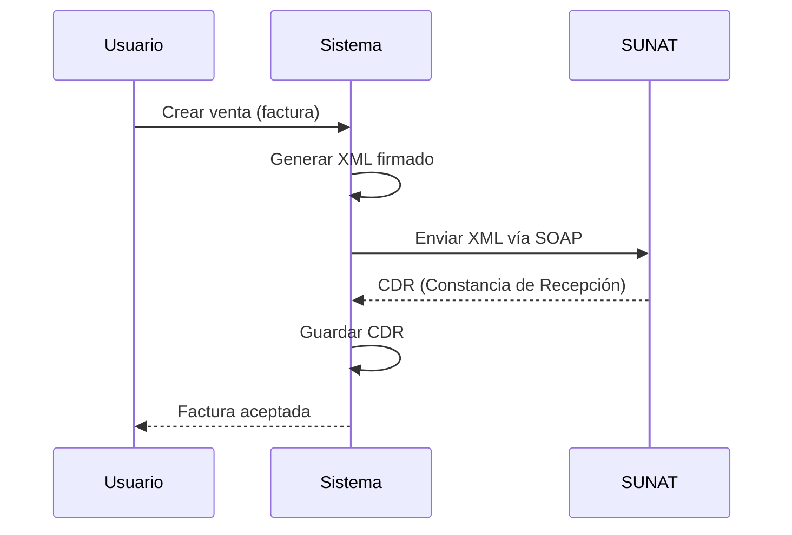
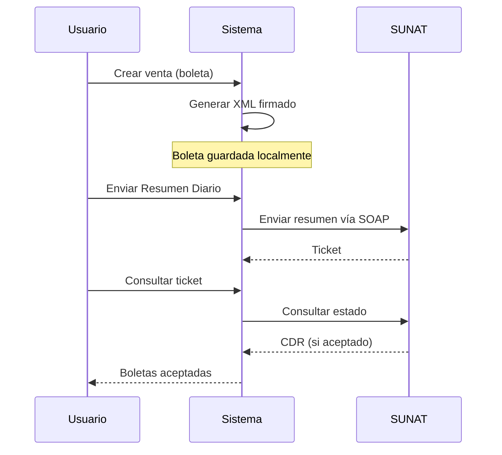

## Descripción General

Las **facturas** (tipo 01) y **boletas** (tipo 03) son comprobantes de pago electrónicos que se generan, firman y envían a SUNAT. Este sistema implementa el flujo completo de facturación electrónica usando la biblioteca Greenter.

## Flujos de Emisión

### Facturas (01) - Flujo Síncrono

Las facturas se envían directamente a SUNAT vía SOAP y reciben respuesta inmediata (CDR).



### Boletas (03) - Flujo con Resumen Diario

Las boletas requieren un paso adicional: envío por **Resumen Diario** (obligatorio).



## Formato de Series

| Tipo | Serie | Ejemplo |
|------|-------|--------|
| Factura | `F###` | F001, F002 |
| Boleta | `B###` | B001, B002 |

Las series se configuran en la tabla `documentos_empresas` y se autoincrementan.

## Generación de XML

### Código Principal

El método `generarXml()` en `SunatService.php` (líneas 154-242) construye el documento XML:

```php
public function generarXml(Venta $venta): array
{
    $venta->load(['cliente', 'empresa', 'productosVentas', 'tipoDocumento', 'cuotas']);
    $empresa = $venta->empresa;
    $cliente = $venta->cliente;

    $codSunat = $venta->tipoDocumento->cod_sunat; // '01' o '03'
    $igvRate = (float) ($empresa->igv ?? config('sunat.igv'));

    $company = $this->buildCompany($empresa);
    $client = $this->buildClient($cliente);

    $invoice = new Invoice();
    $invoice->setUblVersion('2.1')
        ->setTipoOperacion('0101')
        ->setTipoDoc($codSunat)
        ->setSerie($venta->serie)
        ->setCorrelativo((string) $venta->numero)
        ->setFechaEmision($this->fechaParaGreenter($venta->fecha_emision, $venta->created_at))
        ->setTipoMoneda($venta->tipo_moneda ?? 'PEN')
        ->setCompany($company)
        ->setClient($client);

    // Configurar montos según IGV
    if ($apliIgv) {
        $montoGravada = round($total / ($igvRate + 1), 2);
        $igvMonto = round($total / ($igvRate + 1) * $igvRate, 2);
        $invoice->setMtoOperGravadas($montoGravada)
            ->setMtoIGV($igvMonto)
            ->setTotalImpuestos($igvMonto);
    } else {
        $invoice->setMtoOperExoneradas($impVenta)
            ->setMtoIGV(0)
            ->setTotalImpuestos(0);
    }

    // Forma de pago
    $invoice->setFormaPago(
        $tipoPago == '1' ? new FormaPagoContado() : new FormaPagoCredito($impVenta)
    );

    // Detalles (productos)
    $details = $this->buildSaleDetails($venta, $igvRate, $apliIgv);
    $invoice->setDetails($details);

    // Leyenda (monto en letras)
    $invoice->setLegends([
        (new Legend())
            ->setCode('1000')
            ->setValue('SON ' . strtoupper($this->numberToWords($total)) . ' SOLES')
    ]);

    $see = $this->getSee($empresa);
    $xmlContent = $see->getXmlSigned($invoice);
    $nombreArchivo = $invoice->getName(); // {RUC}-{tipoDoc}-{serie}-{numero}

    $this->guardarXml($empresa, $nombreArchivo, $xmlContent);
    $hash = $this->getHashFromXml($xmlContent);

    return [
        'success' => true,
        'nombre_archivo' => $nombreArchivo,
        'hash' => $hash,
        'xml_url' => "sunat/xml/{$ruc}/{$nombreArchivo}.xml",
    ];
}
```

### Construcción de Detalles de Venta

El método `buildSaleDetails()` (líneas 858-901) construye los ítems del comprobante:

```php
private function buildSaleDetails(Venta $venta, float $igvRate, bool $apliIgv): array
{
    $details = [];

    foreach ($venta->productosVentas as $item) {
        $precio = (float) $item->precio_unitario;
        $cantidad = (float) $item->cantidad;

        $detail = new SaleDetail();
        $detail->setCodProducto($item->codigo_producto ?? 'P001')
            ->setCodProdSunat('10000000')
            ->setUnidad($item->unidad_medida ?? 'NIU')
            ->setDescripcion($item->descripcion ?? 'Producto')
            ->setCantidad($cantidad);

        if ($apliIgv) {
            $valorUnitario = round($precio / ($igvRate + 1), 2);
            $valorVenta = round($precio * $cantidad / ($igvRate + 1), 2);
            $igvItem = round($precio * $cantidad / ($igvRate + 1) * $igvRate, 2);

            $detail->setMtoValorUnitario($valorUnitario)
                ->setMtoValorVenta($valorVenta)
                ->setMtoBaseIgv($valorVenta)
                ->setPorcentajeIgv($igvRate * 100) // 18
                ->setIgv($igvItem)
                ->setTipAfeIgv($item->tipo_afectacion_igv ?? '10') // Gravado
                ->setTotalImpuestos($igvItem)
                ->setMtoPrecioUnitario($precio);
        } else {
            $detail->setMtoValorUnitario($precio)
                ->setMtoValorVenta(round($precio * $cantidad, 2))
                ->setTipAfeIgv('20') // Exonerado
                ->setIgv(0);
        }

        $details[] = $detail;
    }

    return $details;
}
```

## Envío a SUNAT (Facturas)

### Método `enviarComprobante()`

Ubicado en `SunatService.php` líneas 244-312:

```php
public function enviarComprobante(Venta $venta): array
{
    $venta->load(['empresa', 'tipoDocumento']);
    $empresa = $venta->empresa;
    $ruc = $this->getRuc($empresa);

    // Buscar XML generado
    $xmlPath = storage_path("app/{$venta->xml_url}");
    if (!file_exists($xmlPath)) {
        return ['success' => false, 'message' => 'XML no encontrado. Genere el XML primero.'];
    }

    $xmlContent = file_get_contents($xmlPath);
    $nombreArchivo = pathinfo($xmlPath, PATHINFO_FILENAME);

    // Enviar vía SOAP
    $see = $this->getSee($empresa);
    $result = $see->sendXml(Invoice::class, $nombreArchivo, $xmlContent);

    if ($result->isSuccess()) {
        $cdr = $result->getCdrResponse();
        $cdrZip = $result->getCdrZip();

        // Guardar CDR
        $cdrDir = storage_path("app/sunat/cdr/{$ruc}");
        if (!is_dir($cdrDir)) {
            mkdir($cdrDir, 0755, true);
        }
        file_put_contents("{$cdrDir}/R-{$nombreArchivo}.zip", $cdrZip);

        // Actualizar venta
        $venta->update([
            'estado_sunat' => '1', // Aceptado
            'cdr_url' => "sunat/cdr/{$ruc}/R-{$nombreArchivo}.zip",
            'codigo_sunat' => $cdr->getCode(),
            'mensaje_sunat' => $cdr->getDescription(),
        ]);

        return [
            'success' => true,
            'codigo' => $cdr->getCode(),
            'mensaje' => $cdr->getDescription(),
            'cdr_url' => "sunat/cdr/{$ruc}/R-{$nombreArchivo}.zip",
        ];
    }

    // Error
    $error = $result->getError();
    $venta->update([
        'estado_sunat' => '2', // Rechazado
        'codigo_sunat' => $error->getCode(),
        'mensaje_sunat' => $error->getMessage(),
        'intentos' => ($venta->intentos ?? 0) + 1,
    ]);

    return [
        'success' => false,
        'codigo' => $error->getCode(),
        'message' => $error->getMessage(),
    ];
}
```

## Resumen Diario (Boletas)

Las boletas **deben** enviarse a SUNAT mediante Resumen Diario. Ver [Resumen Diario](/sunat/daily-summary) para detalles completos.

## Validaciones de Documento por Tipo

Implementadas en `VentasController.php` líneas 128-147:

```php
// Factura (id_tido=2) requiere RUC (11 dígitos)
if ($validated['id_tido'] == 2 && strlen($documento) !== 11) {
    return response()->json([
        'success' => false,
        'message' => 'Para FACTURA se requiere RUC (11 dígitos). No se puede emitir factura con DNI.',
    ], 422);
}

// Boleta (id_tido=1) no permite RUC
if ($validated['id_tido'] == 1 && strlen($documento) === 11) {
    return response()->json([
        'success' => false,
        'message' => 'Para BOLETA use DNI (8 dígitos). Para RUC emita una Factura.',
    ], 422);
}
```

## Manejo de CDR

El **CDR** (Constancia de Recepción) es la respuesta de SUNAT que confirma la aceptación del documento.

### Estructura del CDR

- **Formato**: ZIP comprimido con XML de respuesta
- **Nombre**: `R-{RUC}-{tipoDoc}-{serie}-{numero}.zip`
- **Ubicación**: `storage/app/sunat/cdr/{ruc}/`
- **Códigos comunes**:
  - `0`: Aceptado
  - `0100`: Aceptado con observaciones
  - `2xxx-4xxx`: Errores de validación

### Extracción de Información del CDR

```php
if ($result->isSuccess()) {
    $cdr = $result->getCdrResponse();
    
    $codigo = $cdr->getCode();        // '0'
    $mensaje = $cdr->getDescription(); // 'La Factura numero F001-123 ha sido aceptada'
    $notas = $cdr->getNotes();         // Observaciones adicionales
}
```

## Hash y Firma Digital

### Generación del Hash

El hash se extrae del XML firmado (líneas 952-960):

```php
private function getHashFromXml(string $xml): ?string
{
    if (class_exists(\Greenter\Report\XmlUtils::class)) {
        return (new \Greenter\Report\XmlUtils())->getHashSign($xml);
    }

    // Fallback: extraer del nodo DigestValue
    preg_match('/<ds:DigestValue>([^<]+)<\/ds:DigestValue>/', $xml, $matches);
    return $matches[1] ?? null;
}
```

### Certificado Digital

La firma se realiza con certificado PEM (líneas 68-82):

```php
public function getCertificate(Empresa $empresa): string
{
    $certPath = storage_path("app/sunat/certificados/{$empresa->ruc}-cert.pem");

    if (file_exists($certPath)) {
        return file_get_contents($certPath);
    }

    // Fallback: certificado global de prueba
    $globalCert = config('sunat.certificado_prueba');
    if (file_exists($globalCert)) {
        return file_get_contents($globalCert);
    }

    throw new \RuntimeException('No se encontró certificado PEM para la empresa ' . $empresa->ruc);
}
```

## Zona Horaria y Fechas

CRÍTICO: Greenter usa timezone `America/Lima` en sus templates Twig. Las fechas deben crearse en esa zona para evitar desplazamientos.

```php
private function fechaParaGreenter($fechaRaw, $createdAt = null): \DateTime
{
    $peruTz = new \DateTimeZone('America/Lima');
    $fechaStr = substr((string) ($fechaRaw ?? date('Y-m-d')), 0, 10);

    // Usar hora de creación real en Perú, o 08:00 por defecto
    $hora = '08:00:00';
    if ($createdAt) {
        try {
            $dt = $createdAt instanceof \DateTimeInterface
                ? (new \DateTime($createdAt->format('Y-m-d H:i:s'), new \DateTimeZone('UTC')))->setTimezone($peruTz)
                : (new \DateTime((string) $createdAt))->setTimezone($peruTz);
            $hora = $dt->format('H:i:s');
        } catch (\Exception $e) {
            // fallback
        }
    }

    return new \DateTime("{$fechaStr} {$hora}", $peruTz);
}
```

## Almacenamiento de Archivos

```
storage/app/sunat/
├── xml/
│   └── {ruc}/
│       ├── 20612706702-01-F001-00000001.xml
│       └── 20612706702-03-B001-00000001.xml
├── cdr/
│   └── {ruc}/
│       ├── R-20612706702-01-F001-00000001.zip
│       └── R-20612706702-03-B001-00000001.zip
└── certificados/
    └── 20612706702-cert.pem
```

## Endpoints API

### Crear Venta

```http
POST /api/ventas
Authorization: Bearer {token}

{
  "id_tido": 2,
  "id_cliente": 5,
  "serie": "F001",
  "numero": 123,
  "fecha_emision": "2024-01-15",
  "tipo_moneda": "PEN",
  "subtotal": 100.00,
  "igv": 18.00,
  "total": 118.00,
  "productos": [
    {
      "id_producto": 10,
      "cantidad": 2,
      "precio_unitario": 59.00,
      "subtotal": 100.00,
      "igv": 18.00,
      "total": 118.00
    }
  ]
}
```

Ver `VentasController.php` líneas 80-318.

## Monto en Letras

El método `numberToWords()` (líneas 1177-1241) convierte el total a texto:

```php
// Ejemplo: 1234.56 → "MIL DOSCIENTOS TREINTA Y CUATRO CON 56/100"
$leyenda = 'SON ' . strtoupper($this->numberToWords($total)) . ' SOLES';
```

## Estados SUNAT

| Código | Estado | Descripción |
|--------|--------|-------------|
| `0` | Pendiente | XML generado, no enviado |
| `1` | Aceptado | SUNAT aceptó el documento |
| `2` | Rechazado | SUNAT rechazó el documento |
| `3` | En proceso | Enviado, esperando CDR (tickets) |

## Modo Beta

Para pruebas, configure en `.env`:

```env
SUNAT_MODO=beta
SUNAT_BETA_RUC=20000000001
SUNAT_BETA_USER=MODDATOS
SUNAT_BETA_PASSWORD=moddatos
```

El servicio detecta automáticamente el modo (líneas 52-57):

```php
if ($empresa->modo === 'beta') {
    $beta = config('sunat.beta');
    $see->setClaveSOL($beta['ruc'], $beta['usuario_sol'], $beta['clave_sol']);
} else {
    $see->setClaveSOL($empresa->ruc, $empresa->user_sol, $empresa->clave_sol);
}
```

## Recursos

- [Notas de Crédito](/sunat/credit-debit-notes)
- [Resumen Diario](/sunat/daily-summary)
- [Comunicación de Baja](/sunat/voiding)
- [Guías de Remisión](/sunat/delivery-guides)
