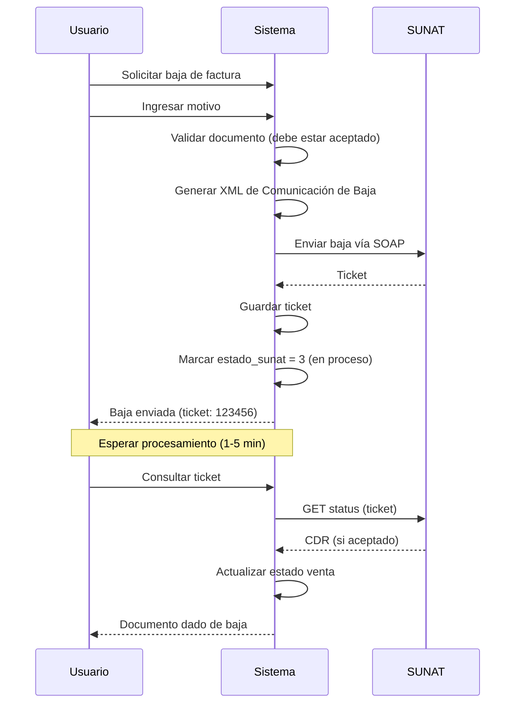

## Descripción General

La **Comunicación de Baja** es un documento que permite anular facturas (01), notas de crédito (07) y notas de débito (08) ya enviadas a SUNAT.

## Diferencias con Resumen Diario

| Aspecto | Comunicación de Baja | Resumen Diario |
|---------|----------------------|----------------|
| Documentos | Facturas, NC, ND | Boletas |
| Códigos SUNAT | 01, 07, 08 | 03 |
| Flujo | Asíncrono (ticket) | Asíncrono (ticket) |
| Obligatorio | No | Sí |
| Clase Greenter | `Voided` | `Summary` |

## Flujo de Comunicación de Baja



## Plazo de Envío

SUNAT permite enviar comunicaciones de baja dentro de los **7 días** siguientes a la emisión del documento.

## Generación de Comunicación de Baja

Método `comunicacionBaja()` en `SunatService.php` (líneas 965-1021):

```php
public function comunicacionBaja(
    Empresa $empresa, 
    array $documentos, 
    string $correlativo = '001'
): array {
    $company = $this->buildCompany($empresa);

    $details = [];
    foreach ($documentos as $doc) {
        $details[] = (new VoidedDetail())
            ->setTipoDoc($doc['tipo_doc'] ?? '01')     // '01', '07', '08'
            ->setSerie($doc['serie'])                   // 'F001'
            ->setCorrelativo($doc['correlativo'])       // '123'
            ->setDesMotivoBaja($doc['motivo'] ?? 'ERROR EN EMISION');
    }

    if (empty($details)) {
        return ['success' => false, 'message' => 'No hay documentos para dar de baja.'];
    }

    $voided = (new Voided())
        ->setCorrelativo($correlativo)
        ->setFecGeneracion(new \DateTime())
        ->setFecComunicacion(new \DateTime())
        ->setCompany($company)
        ->setDetails($details);

    $see = $this->getSee($empresa);
    $nombreArchivo = $voided->getName();

    $result = $see->send($voided);

    $ruc = $this->getRuc($empresa);
    $xmlContent = $see->getFactory()->getLastXml();
    if ($xmlContent) {
        $this->guardarXml($empresa, $nombreArchivo, $xmlContent);
    }

    if ($result->isSuccess()) {
        $ticket = $result->getTicket();

        return [
            'success' => true,
            'ticket' => $ticket,
            'nombre_archivo' => $nombreArchivo,
            'message' => 'Comunicación de baja enviada. Use el ticket para consultar el estado.',
        ];
    }

    $error = $result->getError();
    return [
        'success' => false,
        'codigo' => $error->getCode(),
        'message' => $error->getMessage(),
    ];
}
```

## Estructura de Documentos a Dar de Baja

El array `$documentos` tiene el siguiente formato:

```php
[
    [
        'tipo_doc' => '01',      // Factura
        'serie' => 'F001',
        'correlativo' => '123',
        'motivo' => 'Error en la emisión del documento'
    ],
    [
        'tipo_doc' => '07',      // Nota de Crédito
        'serie' => 'FC01',
        'correlativo' => '45',
        'motivo' => 'Documento duplicado'
    ],
]
```

## Controller de Comunicación de Baja

`ComunicacionBajaController.php` implementa el envío desde la API.

### Método `store()`

Líneas 15-103:

```php
public function store(Request $request): JsonResponse
{
    $request->validate([
        'documentos' => 'required|array|min:1',
        'documentos.*.id_venta' => 'required|integer|exists:ventas,id_venta',
        'documentos.*.motivo' => 'required|string|max:200',
    ]);

    $empresa = Empresa::findOrFail($request->user()->id_empresa);

    $ventas = Venta::with(['tipoDocumento'])
        ->whereIn('id_venta', collect($request->documentos)->pluck('id_venta'))
        ->where('id_empresa', $empresa->id_empresa)
        ->get()
        ->keyBy('id_venta');

    if ($ventas->isEmpty()) {
        return response()->json([
            'success' => false,
            'message' => 'No se encontraron documentos válidos.',
        ], 422);
    }

    $errores = [];
    $documentosBaja = [];
    $motivosMap = collect($request->documentos)->keyBy('id_venta');

    foreach ($ventas as $venta) {
        $codSunat = $venta->tipoDocumento->cod_sunat ?? '';

        // Validación 1: Solo facturas, NC, ND
        if (!in_array($codSunat, ['01', '07', '08'])) {
            $errores[] = "{$venta->numero_completo}: Solo facturas (01), NC (07) y ND (08) pueden darse de baja. Las boletas usan Resumen Diario.";
            continue;
        }

        // Validación 2: Debe estar aceptado por SUNAT
        if ($venta->estado_sunat != '1') {
            $errores[] = "{$venta->numero_completo}: El documento debe estar aceptado por SUNAT (estado_sunat=1).";
            continue;
        }

        // Validación 3: Plazo máximo 7 días
        $fechaEmision = $venta->fecha_emision;
        if ($fechaEmision && $fechaEmision->diffInDays(now()) > 7) {
            $errores[] = "{$venta->numero_completo}: El plazo máximo para comunicación de baja es 7 días desde la emisión.";
            continue;
        }

        $documentosBaja[] = [
            'tipo_doc' => $codSunat,
            'serie' => $venta->serie,
            'correlativo' => (string) $venta->numero,
            'motivo' => $motivosMap[$venta->id_venta]['motivo'],
        ];
    }

    if (!empty($errores) && empty($documentosBaja)) {
        return response()->json([
            'success' => false,
            'message' => 'Ningún documento pasó la validación.',
            'errores' => $errores,
        ], 422);
    }

    try {
        $resultado = $this->sunatService->comunicacionBaja($empresa, $documentosBaja);

        if ($resultado['success']) {
            foreach ($ventas as $venta) {
                $codSunat = $venta->tipoDocumento->cod_sunat ?? '';
                if (in_array($codSunat, ['01', '07', '08']) && $venta->estado_sunat == '1') {
                    $venta->update([
                        'estado_sunat' => '3',  // En proceso
                        'mensaje_sunat' => 'Comunicación de baja enviada. Ticket: ' . ($resultado['ticket'] ?? ''),
                    ]);
                }
            }
        }

        if (!empty($errores)) {
            $resultado['advertencias'] = $errores;
        }

        return response()->json($resultado);
    } catch (\Exception $e) {
        return response()->json([
            'success' => false,
            'message' => 'Error al enviar comunicación de baja: ' . $e->getMessage(),
        ], 500);
    }
}
```

## Consulta de Ticket

Usa el mismo método `consultarTicket()` que el Resumen Diario (`SunatService.php` líneas 1128-1175).

### Desde Controller

`ComunicacionBajaController.php` método `consultarTicket()` (líneas 105-122):

```php
public function consultarTicket(Request $request): JsonResponse
{
    $request->validate([
        'ticket' => 'required|string',
    ]);

    $empresa = Empresa::findOrFail($request->user()->id_empresa);

    try {
        $resultado = $this->sunatService->consultarTicket($empresa, $request->ticket);
        return response()->json($resultado);
    } catch (\Exception $e) {
        return response()->json([
            'success' => false,
            'message' => 'Error al consultar ticket: ' . $e->getMessage(),
        ], 500);
    }
}
```

## Validaciones Implementadas

### 1. Tipo de Documento

Solo se permiten:
- **01**: Facturas
- **07**: Notas de Crédito
- **08**: Notas de Débito

Las **boletas (03)** NO pueden darse de baja por Comunicación de Baja. Deben usar [Resumen Diario](/sunat/daily-summary).

### 2. Estado SUNAT

El documento debe estar **aceptado** (`estado_sunat = 1`). No se pueden dar de baja documentos:
- Pendientes (`estado_sunat = 0`)
- Rechazados (`estado_sunat = 2`)
- Ya en proceso de baja (`estado_sunat = 3`)

### 3. Plazo de Emisión

Máximo **7 días** desde la fecha de emisión del documento.

```php
$fechaEmision = $venta->fecha_emision;
if ($fechaEmision && $fechaEmision->diffInDays(now()) > 7) {
    // Documento fuera de plazo
}
```

## Códigos de Respuesta del Ticket

| Código | Estado | Descripción |
|--------|--------|-------------|
| `0` | Aceptado | Baja procesada correctamente |
| `98` | En proceso | Aún procesando, reintentar |
| `99` | Procesado con errores | Ver detalles en notas |
| Otros | Error | Ver mensaje de error |

## Nomenclatura de Archivos

El nombre del archivo de comunicación de baja sigue el formato:

```
{RUC}-RA-{fecha}-{correlativo}.xml
```

Ejemplo:
```
20612706702-RA-20240115-001.xml
```

Donde:
- `RA` = Resumen de Anulados ("Comunicación de Baja")
- Fecha en formato `YYYYMMDD`
- Correlativo de 3 dígitos

## Endpoints API

```http
# Enviar Comunicación de Baja
POST /api/comunicacion-baja
Authorization: Bearer {token}
{
  "documentos": [
    {
      "id_venta": 100,
      "motivo": "Error en la emisión del documento"
    },
    {
      "id_venta": 101,
      "motivo": "Documento duplicado"
    }
  ]
}

# Consultar Ticket
POST /api/comunicacion-baja/consultar-ticket
{
  "ticket": "1234567890"
}
```

## Ejemplo de Respuesta Exitosa

```json
{
  "success": true,
  "ticket": "1234567890",
  "nombre_archivo": "20612706702-RA-20240115-001",
  "message": "Comunicación de baja enviada. Use el ticket para consultar el estado.",
  "advertencias": [
    "F001-200: El plazo máximo para comunicación de baja es 7 días desde la emisión."
  ]
}
```

## Ejemplo de Respuesta de Consulta de Ticket

### En Proceso

```json
{
  "success": true,
  "codigo": "98",
  "mensaje": "En proceso. Intente nuevamente en unos segundos.",
  "en_proceso": true
}
```

### Aceptado

```json
{
  "success": true,
  "codigo": "0",
  "mensaje": "La Comunicación de Baja ha sido aceptada",
  "notas": []
}
```

### Rechazado

```json
{
  "success": false,
  "codigo": "2324",
  "message": "El documento que desea dar de baja no existe o ya fue dado de baja anteriormente"
}
```

## Actualización de Estados

Al enviar la comunicación de baja:

```php
$venta->update([
    'estado_sunat' => '3',  // En proceso (esperando CDR)
    'mensaje_sunat' => 'Comunicación de baja enviada. Ticket: 1234567890',
]);
```

Después de consultar el ticket y obtener aceptación, se debe actualizar manualmente:

```php
$venta->update([
    'estado' => '2',        // Anulado
    'estado_sunat' => '2',  // Baja aceptada
    'mensaje_sunat' => 'Documento dado de baja correctamente',
]);
```

## Anulación Local vs Comunicación de Baja

### Anulación Local

Se hace ANTES de enviar a SUNAT:

```php
// VentasController.php método anular()
$venta->update(['estado' => '2']);
// Retorna stock si aplica
// NO requiere comunicación a SUNAT (documento nunca fue enviado)
```

Ver `VentasController.php` líneas 355-428.

### Comunicación de Baja

Se hace DESPUÉS de que SUNAT aceptó el documento:

```php
// El documento ya tiene estado_sunat = 1 (aceptado)
// Se envía Comunicación de Baja
// Se espera respuesta de SUNAT vía ticket
// Recién después se marca como anulado
```

## Motivos Comunes de Baja

- Error en la emisión del documento
- Documento duplicado
- Error en el RUC del cliente
- Error en los datos del comprobante
- Anulación por solicitud del cliente
- Operación no realizada

## Almacenamiento de CDR

El CDR de la comunicación de baja se guarda como:

```
storage/app/sunat/cdr/{ruc}/R-ticket-{ticket}.zip
```

Ejemplo:
```
storage/app/sunat/cdr/20612706702/R-ticket-1234567890.zip
```

Ver `SunatService.php` líneas 1138-1144.

## Comparación: Baja vs Resumen Diario vs Nota de Crédito

| Aspecto | Comunicación de Baja | Resumen Diario | Nota de Crédito |
|---------|----------------------|----------------|------------------|
| Documentos | Facturas, NC, ND | Boletas | Facturas, Boletas |
| Flujo | Asíncrono | Asíncrono | Síncrono |
| Propósito | Anular documento | Registrar/anular boletas | Corregir/anular venta |
| Clase | `Voided` | `Summary` | `Note` |
| Genera nuevo doc | No | No | Sí (NC 07) |
| CDR | Vía ticket | Vía ticket | Inmediato |

## Recursos

- [Facturas y Boletas](/sunat/facturas-boletas)
- [Resumen Diario](/sunat/daily-summary)
- [Notas de Crédito y Débito](/sunat/credit-debit-notes)
